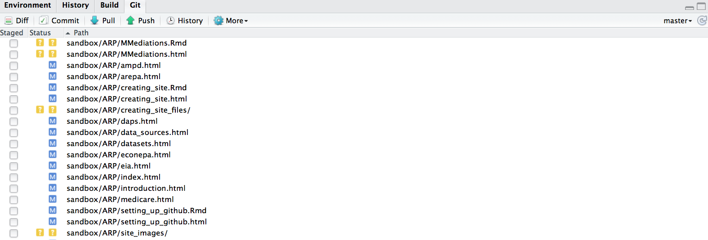
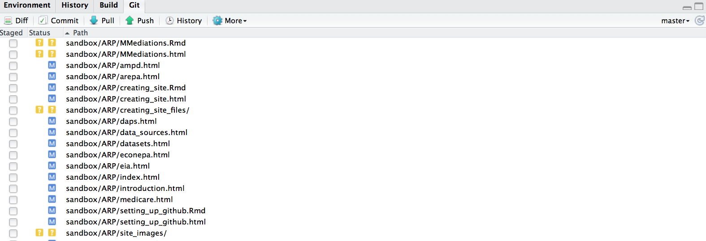

## Overview

This website is written in R Markdown (http://rmarkdown.rstudio.com/).  It can be edited and published from RStudio.

## R Markdown

### Syntax

http://rmarkdown.rstudio.com/authoring_basics.html


### R code

R code and plots can be embedded in chunks.


R chunk options: http://yihui.name/knitr/options

### Example

```{r}
fit <- lm(dist ~ speed, data = cars)
summary(fit)
```

```{r}
plot(fit, 2)
```

## Preview (with RStudio)

### Page

`Knit HTML` button

### Site

One of the four default panels has a `Build` tab with a `Build All` button.  It calls a Makefile which performs all the required steps.


## Publishing

One of the four default panels has a `Git` tab with `Pull` and `Commit` buttons.

### Pull



### Commit

(Don't forget to build the site and select the files of interest!)

Provide a short description of the changes you made:


### Push




